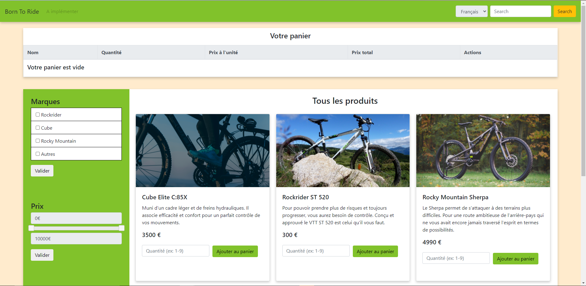
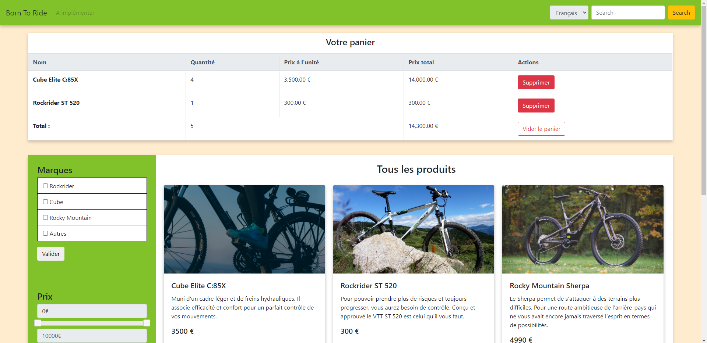

# PHPShopWebsite
Shopping product / cart with PHP  

## Technologies utilisées

* PHP
* HTML
* CSS
* Bootstrap
* JQuery
* phpmyadmin

## Fonctionnalités implémentées

* Base de données contenant les produits
* Filtres prix / marque (catégories)
* Panier `$_SESSION` dynamique se construit en fonction des produits qu'il contient

## Fonctionnalités à venir

* Corriger le filtre `mark`
* Travailler la partie graphique 
* Ajuster le contenu responsif
* Outil de recherche ?
* Site mutlilangue : version anglaise
* Partie admin

## Screens

Site quand le panier est vide :

Quand le panier contient des produits :

